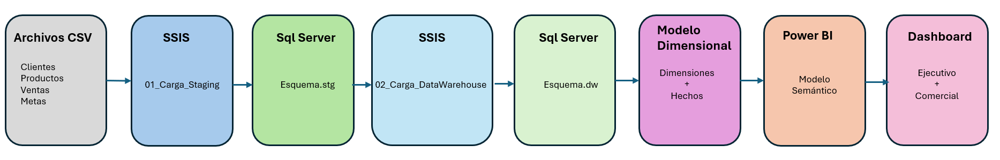
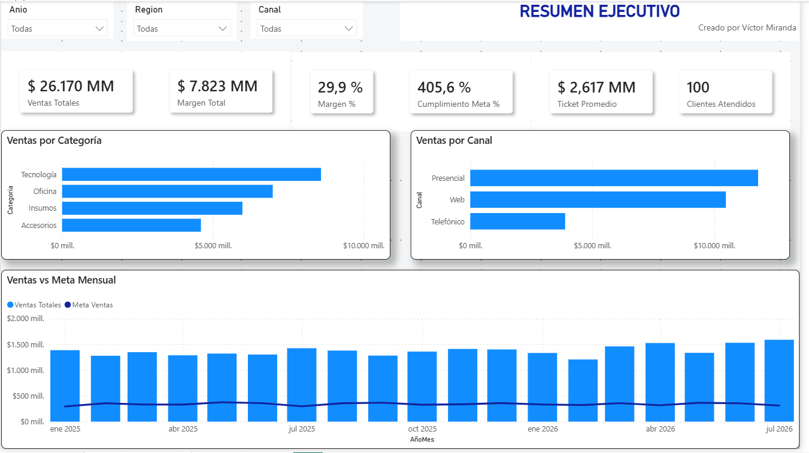
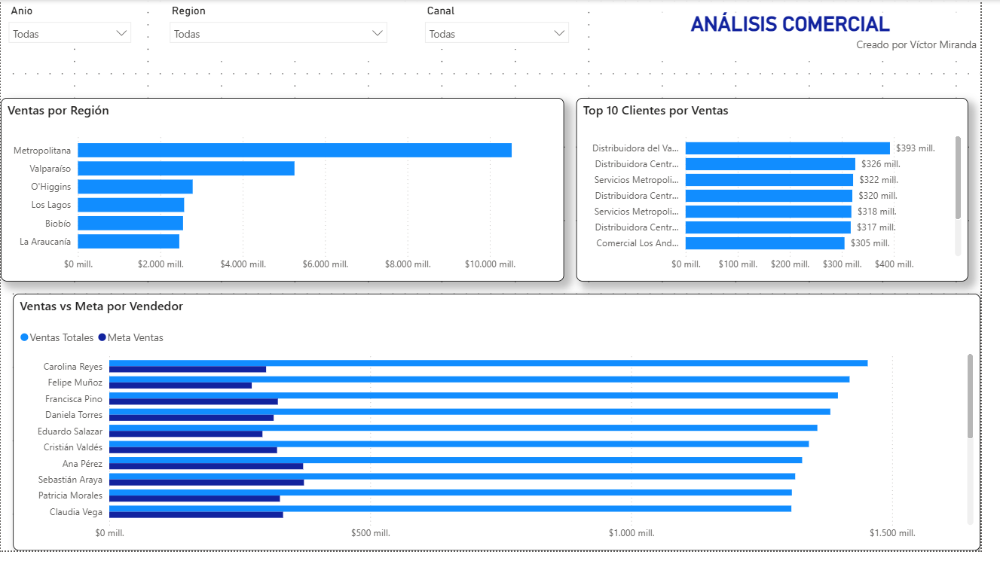

# Pipeline ETL y Data Warehouse de Ventas

Proyecto de Ingeniería de Datos y Business Intelligence que implementa una solución end-to-end para procesar información comercial desde archivos CSV hasta dashboards ejecutivos desarrollados en Power BI.

La solución utiliza **SQL Server, SSIS, Data Warehouse, modelamiento dimensional y Power BI**, separando las distintas etapas del procesamiento para facilitar la trazabilidad, validación y mantenimiento de los datos.

---

## Arquitectura de la solución



El flujo implementado es:

**Archivos CSV → SSIS → SQL Server Staging → SSIS → Data Warehouse → Modelo Dimensional → Power BI → Dashboard**

### Flujo de procesamiento

1. **Archivos CSV**
   Fuentes de datos que contienen información de clientes, productos, vendedores, sucursales, ventas y metas.

2. **SSIS - Carga Staging**
   El paquete `01_Carga_Staging.dtsx` realiza la lectura, validación inicial y carga de los archivos hacia SQL Server.

3. **SQL Server - Esquema stg**
   Área intermedia donde se almacenan los datos antes de aplicar las transformaciones de negocio.

4. **SSIS - Carga Data Warehouse**
   El paquete `02_Carga_DataWarehouse.dtsx` realiza limpieza, normalización, transformación y carga de dimensiones y hechos.

5. **SQL Server - Esquema dw**
   Contiene el Data Warehouse optimizado para análisis y consumo desde herramientas de Business Intelligence.

6. **Modelo dimensional**
   Se implementa un modelo orientado al análisis comercial utilizando dimensiones y tablas de hechos.

7. **Power BI**
   Consume el modelo dimensional, incorpora medidas DAX y permite construir visualizaciones interactivas.

8. **Dashboard Ejecutivo y Comercial**
   Presenta indicadores de ventas, margen, cumplimiento de metas, clientes, vendedores, productos y sucursales.

---

## Modelo dimensional

El modelo está compuesto por dos tablas de hechos principales:

### FactVentas

Contiene las transacciones comerciales utilizadas para analizar:

* Ventas.
* Costos.
* Margen.
* Productos.
* Clientes.
* Vendedores.
* Sucursales.
* Evolución temporal.

### FactMetas

Contiene las metas comerciales utilizadas para comparar los resultados reales con los objetivos definidos.

### Dimensiones

* `DimFecha`
* `DimCliente`
* `DimProducto`
* `DimVendedor`
* `DimSucursal`

Las dimensiones se relacionan con las tablas de hechos mediante relaciones **1:N**, permitiendo realizar análisis desde diferentes perspectivas del negocio.

---

## Datos de demostración

El proyecto utiliza un conjunto de datos preparado para demostrar el funcionamiento completo de la solución:

* **10.000 registros de ventas**
* **380 metas mensuales**
* **100 clientes**
* **50 productos**
* **20 vendedores**
* **10 sucursales**

---

## Procesos ETL

El proceso de integración está dividido en dos paquetes SSIS.

### 01_Carga_Staging.dtsx

Responsable de:

* Lectura de archivos CSV.
* Validación de estructura.
* Conversión de tipos de datos.
* Limpieza inicial.
* Carga de tablas staging.

### 02_Carga_DataWarehouse.dtsx

Responsable de:

* Lectura desde staging.
* Aplicación de reglas de negocio.
* Normalización de información.
* Resolución de claves.
* Carga de dimensiones.
* Carga de tablas de hechos.
* Validación del Data Warehouse.

---

## Controles de calidad

Durante el procesamiento se realizan validaciones orientadas a garantizar la consistencia de la información:

* Conteo de registros.
* Validación de valores nulos.
* Control de tipos de datos.
* Validación de claves.
* Integridad referencial.
* Control de duplicados.
* Validación de relaciones.
* Verificación de cálculos comerciales.

El proceso está diseñado para permitir una **re-ejecución controlada de la carga**, evitando duplicidad de información.

---

## Power BI

La capa de Business Intelligence utiliza el modelo dimensional almacenado en SQL Server.

El reporte incluye principalmente:

### Resumen Ejecutivo

Indicadores principales del negocio:

* Ventas Totales.
* Margen Total.
* Margen %.
* Cumplimiento de Meta %.
* Ticket Promedio.
* Clientes Atendidos.

### Análisis Comercial

Permite analizar los resultados por:

* Cliente.
* Producto.
* Categoría.
* Vendedor.
* Región.
* Sucursal.
* Canal.
* Periodo.

Los segmentadores se encuentran sincronizados para mantener una navegación consistente entre las páginas del reporte.

---

## Tecnologías utilizadas

| Tecnología         | Uso                                        |
| ------------------ | ------------------------------------------ |
| SQL Server         | Base de datos, staging y Data Warehouse    |
| SSIS               | Procesos ETL e integración de datos        |
| SQL                | Transformaciones, validaciones y consultas |
| Data Warehouse     | Almacenamiento analítico                   |
| Modelo dimensional | Organización de dimensiones y hechos       |
| Power BI           | Modelamiento, DAX y dashboards             |
| DAX                | Indicadores y métricas de negocio          |
| GitHub             | Documentación y publicación del proyecto   |

---

## Estructura del repositorio

```text
02_Pipeline_ETL_DataWarehouse_Ventas
│
├── Datos_Demostracion
│
├── Documentacion
│   └── Ficha_Proyecto_Pipeline_ETL_DataWarehouse_Ventas.docx
│
├── Imagenes
│   └── arquitectura_pipeline_etl_dw.png
│
├── SSIS
│   ├── 01_Carga_Staging.dtsx
│   └── 02_Carga_DataWarehouse.dtsx
│
├── SQL
│   └── Scripts SQL del proyecto
│
├── PowerBI
│   └── Archivo Power BI (.pbix)
│
└── README.md
```

---

## Visualización de dashboards

### Resumen Ejecutivo

El dashboard ejecutivo presenta los principales indicadores comerciales de la solución, permitiendo visualizar rápidamente ventas, margen, cumplimiento de metas, ticket promedio y clientes atendidos.



### Análisis Comercial

El dashboard de análisis comercial permite profundizar en el comportamiento de las ventas por cliente, producto, categoría, vendedor, región, sucursal y otros criterios de segmentación.



## 🎥 Video demostrativo

En el siguiente video se presenta el funcionamiento completo de la solución, desde la carga de archivos CSV mediante SSIS hasta la construcción del Data Warehouse y la visualización de los resultados en Power BI.

El video incluye:

▶️ [01_CargaStaging](https://drive.google.com/file/d/1Kd7NdvsuzTfi-3_cKvwMKclZzslW6Q0I/view?usp=drive_link)
▶️ [02_Carga_DataWarehouse](https://drive.google.com/file/d/18pNv1n15JGJVHou1Zto_X0huFIrKhzSs/view?usp=drive_link)
▶️ [03_ArquitecturaDeSolucion](https://drive.google.com/file/d/136dvICf9YCGyk7zJyNDRYBlVjs-4vQY7/view?usp=drive_link)
▶️ [04_DashboardResumenEjecutivo](https://drive.google.com/file/d/15Va_jMOv7Vo7fVtyrIX3wKIrVTC9DeCo/view?usp=drive_link)
▶️ [05_DashboardAnalisisComercial](https://drive.google.com/file/d/1si8SKoNAgnRaQCuWHiVZa4Wvs5rKkuZN/view?usp=drive_link)
▶️ [06_ArquitecturaDeSolucion](https://drive.google.com/file/d/1nn8cB7Fq-Trmlmi1EPI8Rb8Pt4fRB99X/view?usp=drive_link)


## Objetivo del proyecto

Este proyecto busca demostrar la construcción de una solución completa de datos, integrando competencias de:

**Data Engineering + ETL + SQL Server + Data Warehouse + Modelamiento Dimensional + Business Intelligence + Power BI**

La arquitectura permite transformar información proveniente de archivos operacionales en datos estructurados y finalmente en indicadores útiles para la toma de decisiones.

---

## Autor

**Víctor Miranda**

Senior Data Engineer
ETL · SQL Server · SSIS · Data Warehouse · Power BI · DAX

[LinkedIn](https://www.linkedin.com/in/vitoco/)
[GitHub](https://github.com/vitoco888)

