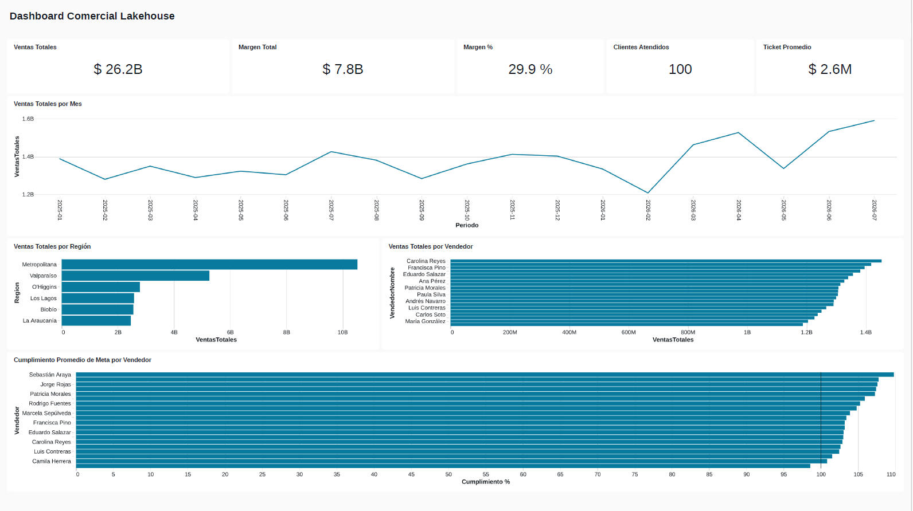
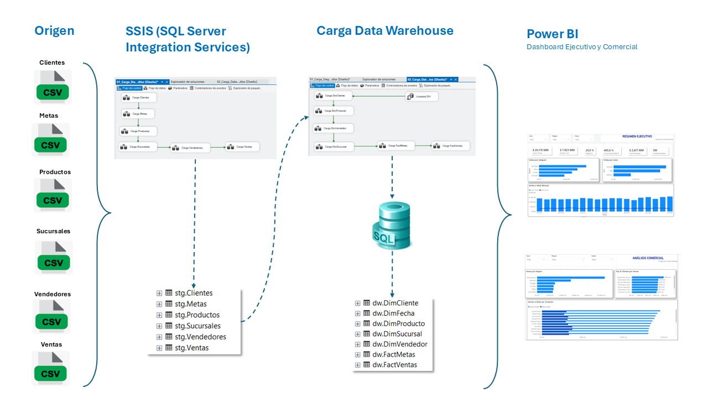
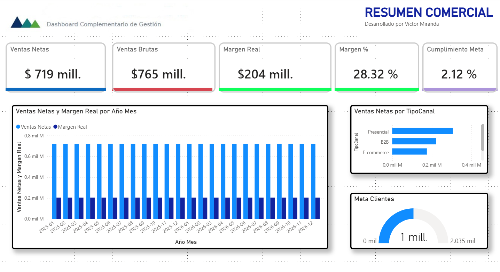

# Hola, soy Víctor Miranda 👋

## Senior Data Engineer | Data Engineering | Business Intelligence

Profesional del área informática con amplia experiencia en integración, transformación, análisis y visualización de datos.

He participado en proyectos del sector bancario y financiero, desarrollando procesos ETL, soluciones de datos, reportes, indicadores de gestión y dashboards orientados a apoyar la toma de decisiones.

---

## 🚀 Portafolio de Proyectos

### 🔶 Databricks Lakehouse de Ventas
Databricks · PySpark · Delta Lake · Arquitectura Medallion  
👉 [Ver proyecto](https://github.com/vitoco888/vitoco888/tree/main/03_Databricks_Lakehouse_Ventas)

### 🔷 Pipeline ETL y Data Warehouse
SQL Server · SSIS · ETL · Data Warehouse · Power BI  
👉 [Ver proyecto](https://github.com/vitoco888/vitoco888/tree/main/02_Pipeline_ETL_DataWarehouse_Ventas)

### 🟨 Dashboard Comercial Power BI
Power BI · DAX · Power Query · Business Intelligence  
👉 [Ver proyecto](https://github.com/vitoco888/vitoco888/tree/main/01_Dashboard_Comercial_PYMEs_PowerBI)

---

## Experiencia y especialidades

- Ingeniería e integración de datos.
- Diseño y desarrollo de procesos ETL/ELT.
- Construcción de pipelines de datos.
- Data Warehouse y modelamiento dimensional.
- Procesamiento y transformación de grandes volúmenes de información.
- Desarrollo de soluciones con Databricks, Spark y SQL.
- Business Intelligence y dashboards en Power BI.
- Automatización, calidad y validación de datos.
- Documentación técnica y levantamiento de requerimientos.
---

## Tecnologías y herramientas

- Azure Databricks, Delta Lake y arquitectura Lakehouse.
- Apache Spark, PySpark, Scala, Hadoop y Hive.
- SQL Server, Oracle, Informix y Netezza.
- SQL, T-SQL, HQL y Python.
- SSIS, DataStage y Control-M.
- Data Warehouse y modelamiento dimensional.
- Power BI, Power Query y DAX.
- Azure Data Explorer.
- GitHub, GitLab, Jira y ServiceNow.
- Scrum y Kanban.

---

# 📂 Detalle de los proyectos

## 01. Databricks Lakehouse de Ventas

Proyecto end-to-end de Ingeniería de Datos desarrollado en Databricks utilizando arquitectura Medallion **Bronze–Silver–Gold**.

El proyecto implementa un flujo completo desde archivos CSV hasta un modelo analítico y dashboard comercial.

### Arquitectura

**CSV → Databricks Volume → Bronze → Silver → Gold → Modelo Dimensional → Databricks SQL → AI/BI Dashboard**

### Principales componentes

- Ingesta de archivos CSV.
- Procesamiento distribuido con PySpark.
- Almacenamiento mediante Delta Lake.
- Arquitectura Medallion Bronze–Silver–Gold.
- Validaciones de calidad e integridad.
- Modelo dimensional en capa Gold.
- Tablas de hechos y dimensiones.
- Consultas analíticas con Databricks SQL.
- Dashboard comercial con AI/BI Dashboards.

### Tecnologías

Databricks · Apache Spark · PySpark · Delta Lake · Unity Catalog · Spark SQL · Databricks SQL · AI/BI Dashboards · Python · SQL

### Dashboard

👉 [Ver Proyecto Databricks Lakehouse de Ventas](https://github.com/vitoco888/vitoco888/tree/main/03_Databricks_Lakehouse_Ventas)

---

## 02. Pipeline ETL y Data Warehouse de Ventas

Solución end-to-end de Ingeniería de Datos y Business Intelligence para transformar información comercial desde archivos CSV hasta dashboards ejecutivos y comerciales.

### Arquitectura

**CSV → SSIS → SQL Server Staging → SSIS → Data Warehouse → Modelo Dimensional → Power BI**

### Principales componentes

- Procesos ETL desarrollados con SSIS.
- Capa Staging en SQL Server.
- Data Warehouse con modelo dimensional.
- Tablas de hechos `FactVentas` y `FactMetas`.
- Dimensiones de Fecha, Cliente, Producto, Vendedor y Sucursal.
- Controles de calidad e integridad de datos.
- Medidas DAX e indicadores comerciales.
- Dashboard Ejecutivo y Análisis Comercial en Power BI.

### Tecnologías

SQL Server · SQL · SSIS · ETL · Data Warehouse · Modelamiento Dimensional · Power BI · DAX

### Arquitectura de la solución

👉 [Ver Proyecto Pipeline ETL y Data Warehouse](https://github.com/vitoco888/vitoco888/tree/main/02_Pipeline_ETL_DataWarehouse_Ventas)

---

## 03. Dashboard Comercial para PYMEs – Power BI

Solución de Business Intelligence desarrollada para analizar información comercial y apoyar la toma de decisiones.

El dashboard permite analizar:

- Ventas netas y brutas.
- Costos y rentabilidad.
- Margen comercial.
- Clientes.
- Productos y categorías.
- Canales de venta.
- Sucursales.
- Regiones.
- Cumplimiento de metas.

El proyecto incluye dashboard interactivo, indicadores comerciales, documentación, imágenes, archivo PBIX y videos demostrativos.

### Tecnologías

Power BI · Power Query · DAX · Modelamiento de Datos · Business Intelligence

### Dashboard

👉 [Ver Proyecto Dashboard Comercial para PYMEs](https://github.com/vitoco888/vitoco888/tree/main/01_Dashboard_Comercial_PYMEs_PowerBI)

---

## Áreas de aporte

- Integración y transformación de datos desde múltiples fuentes.
- Desarrollo de procesos ETL/ELT y pipelines de datos.
- Construcción de Data Warehouse y modelos dimensionales.
- Automatización y controles de calidad de información.
- Desarrollo de soluciones analíticas y dashboards en Power BI.
- Generación de indicadores de gestión y reportería.
- Documentación técnica y soporte a usuarios.

---

## Objetivo profesional

Aportar experiencia en proyectos de Ingeniería de Datos, análisis y Business Intelligence, transformando información en soluciones confiables que apoyen la gestión y la toma de decisiones.

---

## 📄 Curriculum Vitae

Puedes consultar mi experiencia profesional, formación y principales competencias en mi currículum actualizado.

[📄 Ver Curriculum Vitae](./CV_Victor_Miranda.pdf)

---

## 📬 Contacto profesional

- GitHub: [github.com/vitoco888](https://github.com/vitoco888)
- LinkedIn: [linkedin.com/in/vitoco](https://www.linkedin.com/in/vitoco/)
